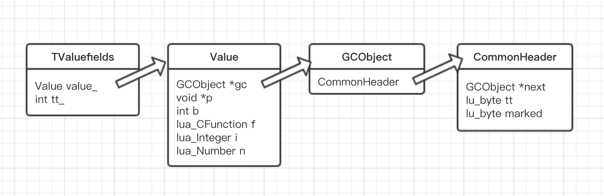

# Lua中的数据类型

在 Lua 中，分为以下几种数据类型:

```c
/**
 * Lua 基本类型
 * (lua.h)
 */

#define LUA_TNONE		(-1)

#define LUA_TNIL		0
#define LUA_TBOOLEAN		1
#define LUA_TLIGHTUSERDATA	2
#define LUA_TNUMBER		3
#define LUA_TSTRING		4
#define LUA_TTABLE		5
#define LUA_TFUNCTION		6
#define LUA_TUSERDATA		7
#define LUA_TTHREAD		8
```

其中大部分类型很容易理解，比如`LUA_TNUMBER`就表示的数值类型，`LUA_TBOOLEAN`表示的是布尔类型，不过这里有两个比较特殊的类型：`LUA_TLIGHTUSERDATA`和`LUA_TUSERDATA`一样，对应的都是`void*`指针，区别在于，`LUA_TLIGHTUSERDATA`的分配释放是由 Lua 外部的使用者来完成，而`LUA_TUSERDATA`则是通过 Lua 内部来完成的，换言之，前者不需要 Lua 去关心它的生存期，由使用者自己去关注，后者则反之。

那么 Lua 中是怎么样表示一个数据呢，可以看一下源代码

```c
/**
 * Union of all Lua values
 * (lobject.h)
 */
typedef union Value {
  GCObject *gc;    /* collectable objects */
  void *p;         /* light userdata */
  int b;           /* booleans */
  lua_CFunction f; /* light C functions */
  lua_Integer i;   /* integer numbers */
  lua_Number n;    /* float numbers */
} Value;
```

源代码注释已经很详细了，不过这些数据到底是什么类型的。于是 Lua 代码中又有了一个`TValuefields`，将`Value`和类型结合在一起:

```c
/**
 * value_ 值内容
 * tt_ 类型
 * (lobject.h)
 */
#define TValuefields	Value value_; int tt_
```

其中`tt_`表示的就是数据的类型，但它并不是直接用数值进行表示，而是用不同的位代表不同的含义，从`lobject.h`源代码中可知，类型`tt_`有如下规则：

- 0-3 位：实际的类型，对应上文（lua.h）中的`LUA_T*`字段
- 4-5 位：为变体类型位，对于不同的类型，变体有其不同的含义
    - function:
        - 0 Lua function
        - 1 Light C function
        - 2 Regular C function
    - string:
        - 0 short string
        - 1 long string
    - number:
        - 0 float number
        - 1 integer number
- 6 位：表示类型是否可以可以被 gc

Lua 在`lobject.h`中提供了一系列宏来方便类型检查、类型转换。

回到`Value`这个联合体，可以看到，基础类型非常简单，直接用其中的字段进行表示，接下来主要看一下需要进行 gc 的数据

Lua 内部用一个宏`iscollectable`，表示哪些数据类型需要进行 gc 操作的，下面是相关代码：

```c
/* (lobject.h) */

/* Bit mark for collectable types */
#define BIT_ISCOLLECTABLE	(1 << 6)

/* TValue 的类型 */
#define rttype(o)	((o)->tt_)

// 判断类型是否为可GC类型
#define iscollectable(o)	(rttype(o) & BIT_ISCOLLECTABLE)
```

可以看到，`tt_`的第6位用来表示该数据是否可回收

那么，对于这些需要进行 gc 操作的数据类型，在 Lua 中是如何表示的呢?

这些需要 gc 的数据类型，都会有一个`CommonHeader`的成员，并且这个成员在结构体定义的最开始部分，如:

```c
/**
 * Lua Table 实现
 * (lobject.h)
 */
typedef struct Table {
  CommonHeader;
  lu_byte flags;  /* 1<<p means tagmethod(p) is not present */
  lu_byte lsizenode;  /* log2 of size of 'node' array */
  unsigned int sizearray;  /* size of 'array' array */
  TValue *array;  /* array part */
  Node *node;
  Node *lastfree;  /* any free position is before this position */
  struct Table *metatable;
  GCObject *gclist;
} Table;
```

其中`CommonHeader`的定义如下:

```c
/*
** Common Header for all collectable objects (in macro form, to be
** included in other objects)
** (lobject.h)
*/
#define CommonHeader	GCObject *next; lu_byte tt; lu_byte marked
```

同时，还有一个名为`GCObject`的结构体，其中的成员只有`CommonHeader`:

```c
/*
** Common type has only the common header
** (lobject.h)
*/
struct GCObject {
  CommonHeader;
};
```  

于是，在 Lua 中就使用了一个`GCUnion`的 union 将所有可 gc 类型囊括了进来:

```c
/*
** Union of all collectable objects (only for conversions)
** (lstate.h)
*/
union GCUnion {
  GCObject gc;  /* common header */
  struct TString ts;
  struct Udata u;
  union Closure cl;
  struct Table h;
  struct Proto p;
  struct lua_State th;  /* thread */
};
```

我们整理一下前面提到的这么几个结构体，可以得到这样的结论:

1. 任何需要 gc 的 Lua 数据类型，必然以`CommonHeader`做为该结构体定义的最开始部分。如果熟悉C++类实现原理的人，可以将`CommonHeader`这个成员理解为一个基类的所有成员，而其他需要 gc 的数据类型均从这个基类中继承下来，所以它们的结构体定义开始部分都是这个成员。

2. `GCUnion`这个 union，将所有需要 gc 的数据类型全部囊括其中，这样在定位和查找不同类型的数据时就来的方便多了，而如果只想要它们的 gc 部分，可以通过`Value`的`gc`字段，如:

```c
/* (lobject.h) */
#define val_(o)		((o)->value_)

#define gcvalue(o)	check_exp(iscollectable(o), val_(o).gc)
```

以上提到的结构关系如下图：


