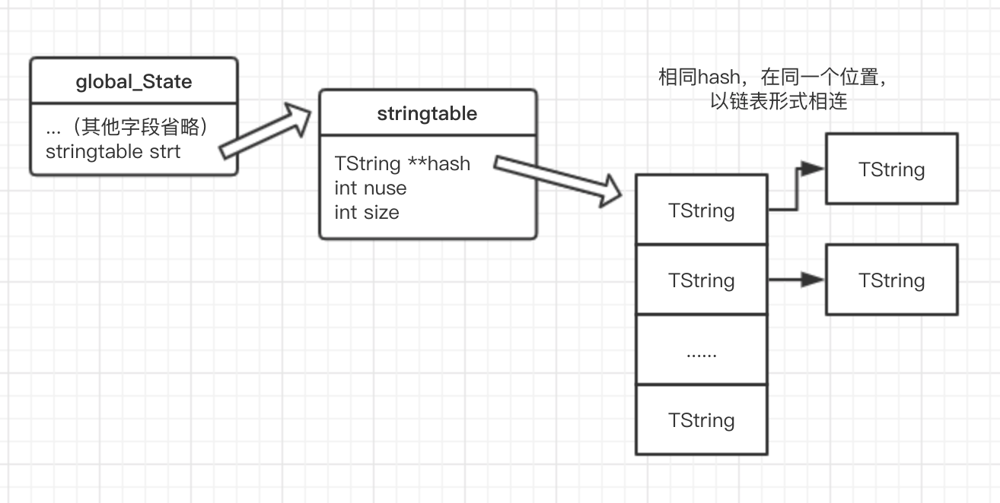
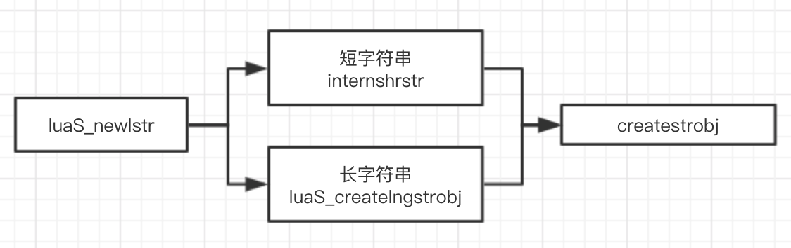

# Lua字符串

## 0. 概述
C 语言并没有自带处理字符串类型的库，然而对于一门编程语言来说，字符串的处理又是基础中的基础，因此，Lua 自己实现了一个处理字符串的类型和相关 API

一般来说，要表示一个字符串，核心就是要表示一下两个数据：

1. 字符串的长度
2. 指向存放字符串内存数据的指针

## 1. Lua 字符串数据结构定义

首先我们来看 Lua 中表示字符串的数据结构定义:

```c
/* (lobject.h) */

/*
** Header for string value; string bytes follow the end of this structure
** (aligned according to 'UTString'; see next).
*/
typedef struct TString {
  CommonHeader;
  lu_byte extra;  /* reserved words for short strings; "has hash" for longs */
  lu_byte shrlen;  /* length for short strings */
  unsigned int hash;
  union {
    size_t lnglen;  /* length for long strings */
    struct TString *hnext;  /* linked list for hash table */
  } u;
} TString;

/*
** Ensures that address after this type is always fully aligned.
*/
typedef union UTString {
  L_Umaxalign dummy;  /* ensures maximum alignment for strings */
  TString tsv;
} UTString;
```

可以看见，Lua 这里有两个结构：

1. `TString`：

    其中字段基本都有注释，也比较容易理解

    - `CommonHeader`：gc 对象通用部分
    - `extra`：对于短字符串来说为表示保留字，对长字符串 来说表示是否计算过 hash
    - `shrlen`：表示短字符串的长度，对长字符串无意义
    - `hash`：表示该字符串的 hash 值，如果是短字符串，则该 值在创建时就计算好，因为短字符串会被添加到全局的字符串表 中，避免重复创建；而对于长字符串，该值并不会立即计算，而 是在需要它的时候再进行计算，计算函数为 `luaS_hashlongstr (TString *ts) // lstring.c`， 一旦计算过，便会将上面提到的`extra`字段设置为1，避免重复 计算
    - `union { lnglen; hnext; }`：对于短字符串来说，`lnglen`没有意义，由于该串将被加入到全局的字符串表中，因此`hnext`表示表中下一个串，对于长字符串来说，`hnext`没有意义，`lnglen`表示长字符串的长度，这里长字符串和短字符串之所以没有用同一个字段来表示，是因为长字符串长度可能非常长，然后短字符串最长为40

2. `UTString`

    可以看见是一个 union，其目的是为了让`TString`数据类型 按照`L_Umaxalign`类型来进行对齐

    ```c
    /* type to ensure maximum alignment */
    #if defined(LUAI_USER_ALIGNMENT_T)
    typedef LUAI_USER_ALIGNMENT_T L_Umaxalign;
    #else
    typedef union {
       lua_Number n;
       double u;
       void *s;
       lua_Integer i;
       long l;
    } L_Umaxalign;
    #endif
    ```

    C 语言中，struct/union 这样的复合数据类型，是按照这个类型中最大对齐量的数据来进行对齐的，而在结构体`UTString`中，其最大的对齐单位肯定不会比 double 大，所以整个`UTString` union 是按照 double 的对齐量来进行对齐的。

    可以从`UTString`的注释中得知，这样设计的目的是为了保证后面紧跟着的字符串 bytes 内存始终是满对齐，之所以要进行对齐操作，是为了在 CPU 读取数据时性能更高

## 2. 长串和短串

从上面看出，Lua 内部对字符串的实现分成了**短字符串**和**长字符串**，对它们的操作也不尽相同。比如创建一个短字符串首先会查询全局字符串表，如果已经存在了，则直接复用，否则再进行创建，而创建一个长字符串，则直接创建，允许冗余。那么为什么要这么做呢，基本上是因为如下理由：

1. 复用性：显而易见的短字符串的重复度会比长字符串高很多，由于 table 是 Lua 唯一的数据结构，字符串又作为 table 非常重要的键，无论是使用 table 访问其键对应的值，还是在其他地方直接使用字符串，短字符串的出现次数都远大于长字符串，因此，将短字符串缓存起来，将大大避免内存浪费

2. 哈希效率：计算短字符串哈希的耗时要明显短于长字符串

那么，Lua 中怎么区别短字符串和长字符串呢，以下代码给出了答案

```c
/*
** Maximum length for short strings, that is, strings that are
** internalized. (Cannot be smaller than reserved words or tags for
** metamethods, as these strings must be internalized;
** #("function") = 8, #("__newindex") = 10.)
*/
#if !defined(LUAI_MAXSHORTLEN)
#define LUAI_MAXSHORTLEN	40
#endif
```

由上可见，长度大于 40 的字符串定义为长字符串，反之则为短字符串

## 3. 全局字符串表

在Lua中，所有短字符串都保存在一个全局的地方，在`global_state`的`strt`里面，这是一个 hash 数组，专门用于存放字符串:

```c
typedef struct stringtable {
  TString **hash;
  int nuse;  /* number of elements */
  int size;
} stringtable;
```

其中：

- `hash`：存放`TString`的 hashmap，也叫做散列桶。基本结构是一个数组，每个数组里存的是相同 hash 值的`TString`的链表
- `nuse`：当前实际的元素数
- `size`：当前的桶大小

结构如下图：



## 4. 字符串相关函数

上面提到了字符串内部实现机制，接下来就让我们直接跟着源码分析一下

### 4.1 字符串创建函数

```c
/*
** new string (with explicit length)
** 创建一个给定长度的字符串
** (lstring.c)
*/
TString *luaS_newlstr (lua_State *L, const char *str, size_t l) {
  // 判断是否为短字符串
  if (l <= LUAI_MAXSHORTLEN)  /* short string? */
    // 如果是短字符串，则执行内部逻辑
    return internshrstr(L, str, l);
  else {
    // 否则为长字符串
    TString *ts;

    // 如果字符串太长，超出最大尺寸，则创建失败，并报错
    if (l >= (MAX_SIZE - sizeof(TString))/sizeof(char))
      luaM_toobig(L);

    // 直接创建长字符串，并拷贝字符串内容
    ts = luaS_createlngstrobj(L, l);
    memcpy(getstr(ts), str, l * sizeof(char));

    return ts;
  }
}
```

这个函数比较简单，上面的注释也比较全，就不再细说了，由`luaS_newlstr`这个函数，又引出了创建短字符串的`internshrstr`函数及创建长字符串的`luaS_createlngstrobj`函数

首先我们看一下`internshrstr`函数：

```c
/*
** checks whether short string exists and reuses it or creates a new one
** 检查短字符串是否已经存在，如果存在则复用，否则创建一个新的
** (lstring.c)
*/
static TString *internshrstr (lua_State *L, const char *str, size_t l) {
  TString *ts;
  global_State *g = G(L);
  // 计算短字符串的 hash
  unsigned int h = luaS_hash(str, l, g->seed);

  // 取全局字符串表中对应 hash 位置的链表
  TString **list = &g->strt.hash[lmod(h, g->strt.size)];

  lua_assert(str != NULL);  /* otherwise 'memcmp'/'memcpy' are undefined */

  // 遍历链表，查找是否存在相同的字符串
  for (ts = *list; ts != NULL; ts = ts->u.hnext) {
    if (l == ts->shrlen &&
        (memcmp(str, getstr(ts), l * sizeof(char)) == 0)) {
      /* found! */
      // 如果找到，进一步判断字符串是否在当前 GC 阶段被判定为需要回收，如果是，则修改它的状态为不需要回收
      if (isdead(g, ts))  /* dead (but not collected yet)? */
        changewhite(ts);  /* resurrect it */

      // 直接返回查找到的字符串
      return ts;
    }
  }

  // 这里判断全局表是否需要扩充
  if (g->strt.nuse >= g->strt.size && g->strt.size <= MAX_INT/2) {
    luaS_resize(L, g->strt.size * 2);
    list = &g->strt.hash[lmod(h, g->strt.size)];  /* recompute with new size */
  }

  // 创建一个字符串对象
  ts = createstrobj(L, l, LUA_TSHRSTR, h);
  memcpy(getstr(ts), str, l * sizeof(char));
  ts->shrlen = cast_byte(l);

  // 添加到全局字符串表中
  ts->u.hnext = *list;
  *list = ts;
  g->strt.nuse++;

  return ts;
}
```

注释也比较详细了，接着我们看一下创建长字符串的函数`luaS_createlngstrobj`

```c
TString *luaS_createlngstrobj (lua_State *L, size_t l) {
  TString *ts = createstrobj(L, l, LUA_TLNGSTR, G(L)->seed);
  ts->u.lnglen = l;
  return ts;
}
```

内容非常简单，没有额外的查找逻辑，直接创建字符串对象，然后返回

无论创建长字符串还是短字符串，这里都调用了另一个函数`createstrobj`

```c
/*
** creates a new string object
*/
static TString *createstrobj (lua_State *L, size_t l, int tag, unsigned int h) {
  TString *ts;
  GCObject *o;
  size_t totalsize;  /* total size of TString object */
  // 计算字符串对象真正的大小，由于上一章我们知道，字符串对象是由一个`UTString`的联合体后面跟着真正的字符数组构成，因此这里大小 = sizeof(union UTString) + ((l) + 1) * sizeof(char)，char 尺寸多 +1 是为了后面添加一个 '\0' 用于标记字符串结束
  totalsize = sizelstring(l);

  // 创建一个 GCObject
  o = luaC_newobj(L, tag, totalsize);

  // 将 GCObject 强制转换成 TString
  ts = gco2ts(o);

  // 为对应字段赋值
  ts->hash = h;
  ts->extra = 0;
  getstr(ts)[l] = '\0';  /* ending 0 */

  return ts;
}
```

最终，整个创建字符串的函数结构如下图：



### 4.2 保留字相关函数

上文提到`TString`中有一个`extra`字段，对于短字符串来说用来表示保留字，那么就来看看它的含义

```c
/* llex.c */

/* ORDER RESERVED */
static const char *const luaX_tokens [] = {
    "and", "break", "do", "else", "elseif",
    "end", "false", "for", "function", "goto", "if",
    "in", "local", "nil", "not", "or", "repeat",
    "return", "then", "true", "until", "while",
    "//", "..", "...", "==", ">=", "<=", "~=",
    "<<", ">>", "::", "<eof>",
    "<number>", "<integer>", "<name>", "<string>"
};

void luaX_init (lua_State *L) {
  int i;
  TString *e = luaS_newliteral(L, LUA_ENV);  /* create env name */
  luaC_fix(L, obj2gco(e));  /* never collect this name */
  for (i=0; i<NUM_RESERVED; i++) {
    TString *ts = luaS_new(L, luaX_tokens[i]);

    // 保留字永远不会被垃圾回收
    luaC_fix(L, obj2gco(ts));  /* reserved words are never collected */

    // 标记保留字字段
    ts->extra = cast_byte(i+1);  /* reserved word */
  }
}
```

这里`extra`存放的值，是数组`luaX_tokens`中的索引.这样一方面可以迅速定位到是哪个关键字，另方面如果这个`extra`字段不为 0，则表示该字符串是不可自动回收的，在GC过程中会略过这个字符串的处理

`luaX_tokens`里的每个字符串都是与某个保留字Token类型一一对应的:

需要说明的是，上面`luaX_tokens`字符串数组中的"\<number>"，"\<integer>"，"\<name>"，"\<string>"，"\<eof>"这几个字符串并不真实做为 Lua 语言中的保留关键字存在，但是因为有相应的保留字 Token 类型，所以也就干脆这么定义一个对应的字符串了.

### 4.3 其他相关宏或函数

1. `getstr`宏：得到真正的字符串序列

    ```c
    /* (lobject.h) */

    /*
    ** Get the actual string (array of bytes) from a 'TString'.
    ** (Access to 'extra' ensures that value is really a 'TString'.)
    */
    #define getstr(ts)  \
    check_exp(sizeof((ts)->extra), cast(char *, (ts)) + sizeof(UTString))
    ```

    这个宏很简单，我们知道 Lua 字符串序列真正的存放的位置紧跟在`UTString`这个联合体后，因此我们只需将指针偏移一个`UTString`尺寸，即可指向真正的字符串序列

2. 字符串比较`eqshrstr`宏及`luaS_eqlngstr`方法

    ```c
    /* 短字符串比较 (lstring.h) */

    /*
    ** equality for short strings, which are always internalized
    */
    #define eqshrstr(a,b)	check_exp((a)->tt == LUA_TSHRSTR, (a) == (b))
    ```

    由于短字符串是复用的，因此只需要比较两个指针是否相等即可

    ```c
    /* 长字符串比较 (lstring.c) */

    /*
    ** equality for long strings
    */
    int luaS_eqlngstr (TString *a, TString *b) {
    size_t len = a->u.lnglen;
    lua_assert(a->tt == LUA_TLNGSTR && b->tt == LUA_TLNGSTR);
    return (a == b) ||  /* same instance or... */
        ((len == b->u.lnglen) &&  /* equal length and ... */
        (memcmp(getstr(a), getstr(b), len) == 0));  /* equal contents */
    }
    ```

    长字符串比较相对复杂一点，先比较两个指针是否相等，再比较两个长字符串长度是否一致，最后对内存进行比较
